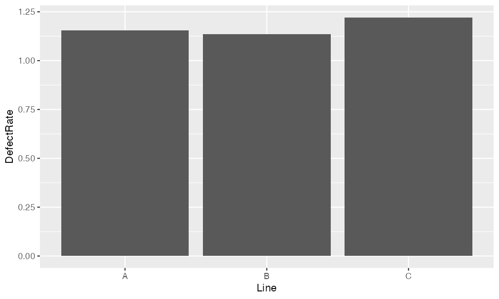
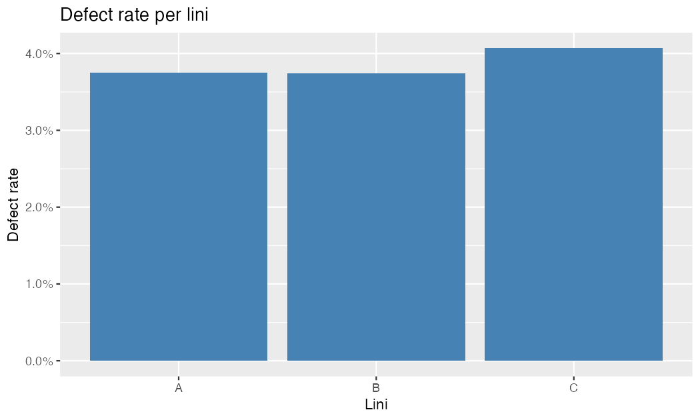
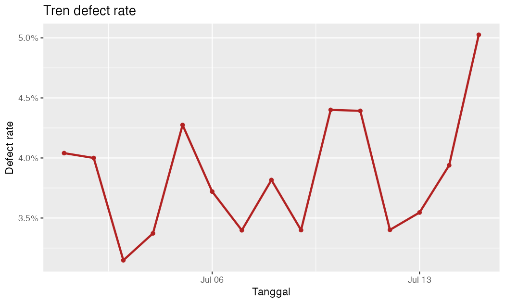
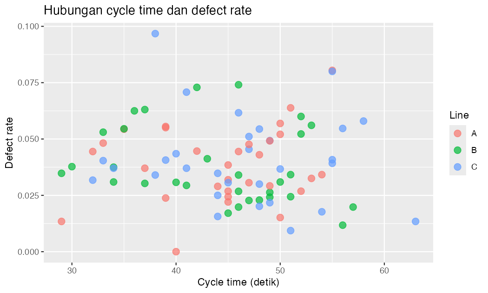
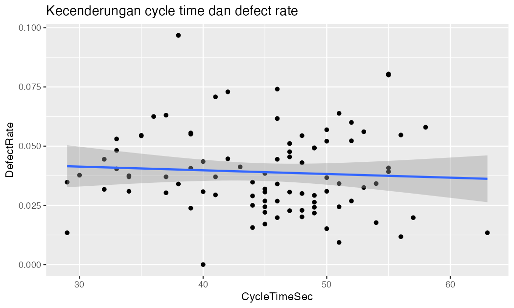
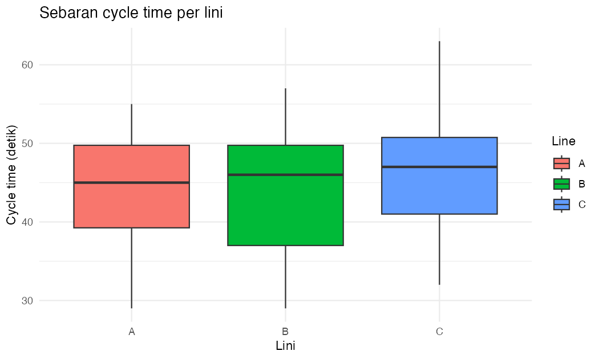
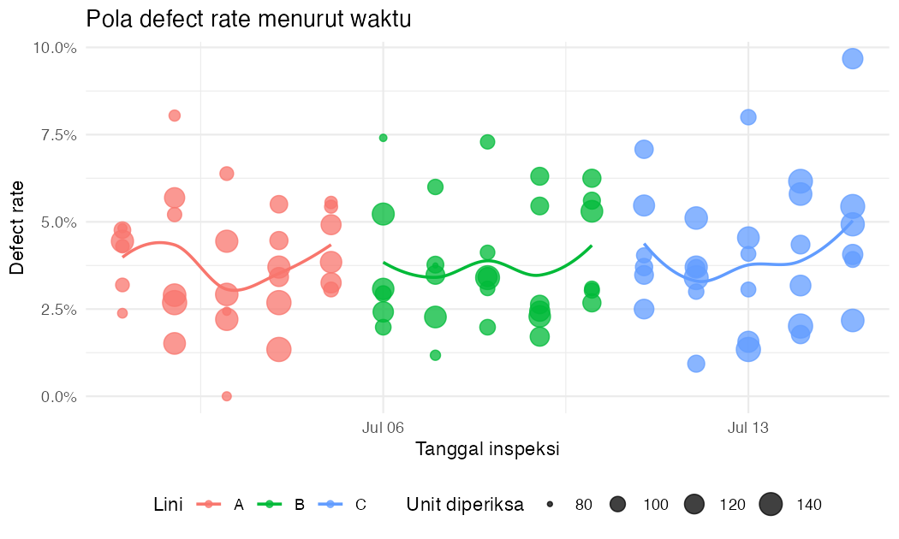
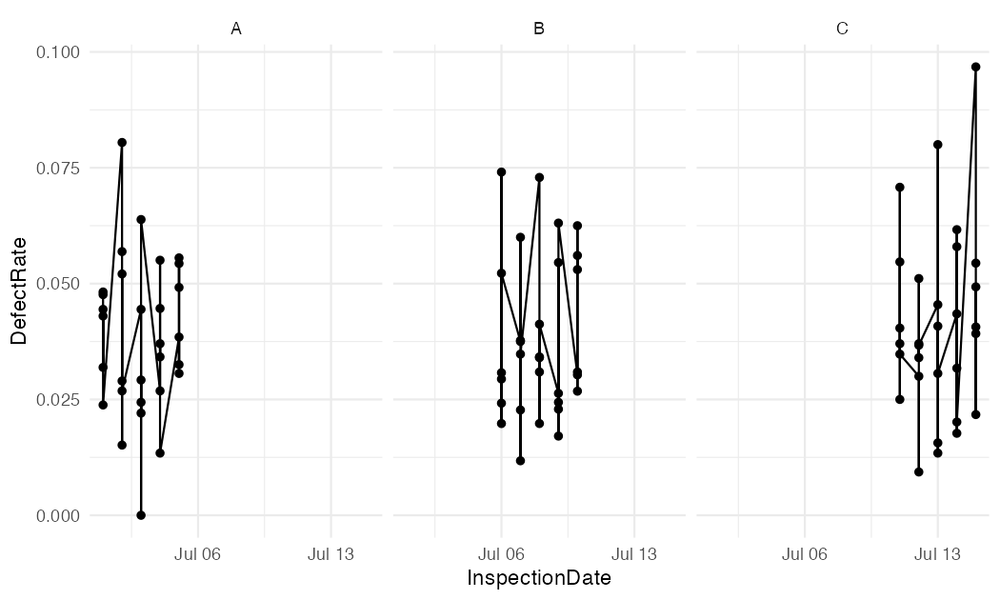

# R Basics — Foundation, Data Manipulation & Visualization

> **Project guide:** [Main project README](README.md) · [R Cheat Sheet](CHEATSEET.MD)


> Panduan ini menyediakan fondasi R lengkap untuk project **Demand & Capacity What-If Analysis**, termasuk data preparation, transformation, visualization, forecasting, dan Power BI R Visual.
>
> 1. **Basic R** — pengenalan R, RStudio, sintaks dasar, tipe data, vektor, fungsi, dan logika;
> 2. **Data Manipulation** — membuat data latihan (generate), membersihkan data, dan mengolah data dengan `dplyr`;
> 3. **Data Visualization** — visualisasi data dengan `ggplot2` dari grafik sederhana hingga multi-variabel.

---

## 1. Gambaran Umum

| Komponen | Keterangan |
| --- | --- |
| **Nama proyek** | R Basics untuk Demand & Capacity |
| **Topik materi** | Basic R, Data Manipulation, Data Visualization |
| **Bahasa** | R, RStudio Desktop |
| **Package utama** | `tidyverse`, `lubridate`, `scales` |
| **Prerequisit** | Tidak diperlukan pengalaman sebelumnya (pemula mutlak) |
| **Luaran** | Kemampuan dasar menulis kode R, mengolah data, dan membuat grafik sebagai referensi project Demand & Capacity |

### Alur belajar (roadmap)

```text
Basic R
  -> R & RStudio
  -> Sintaks & objek
  -> Tipe data & vektor
  -> Fungsi & logika

Data Manipulation
  -> Membuat data latihan (generate, tanpa CSV)
  -> Membaca data dari file (opsional)
  -> Memahami struktur data
  -> dplyr: select, filter, mutate, arrange, group_by, summarise
  -> Pipeline dan cleaning lengkap

Data Visualization
  -> Konsep layer ggplot2
  -> Bar, line, scatter, boxplot
  -> Multi-variabel & formatting
  -> Menyimpan grafik
```

---

## 2. Tujuan Pembelajaran

Setelah menyelesaikan **R Basics**, Anda diharapkan mampu:

1. Menginstal dan menjalankan R serta RStudio.
2. Membuat objek, vektor, dan data frame.
3. Menggunakan operator, fungsi, dan logika dasar R.
4. Membuat data latihan dengan kode R (generate) dan memahami struktur data.
5. Melakukan cleaning dan transformasi data dengan `dplyr`.
6. Membuat grafik dasar hingga multi-variabel dengan `ggplot2`.
7. Menyimpan hasil analisis (data bersih, ringkasan, dan grafik) untuk proyek lanjutan.

> Gunakan panduan ini sebagai referensi dasar sebelum menjalankan kode pada [README project](README.md).

---

## 3. Prerequisites and RStudio Setup

### 3.1 Instalasi

| Software | URL | Fungsi |
| --- | --- | --- |
| **R** | <https://cran.r-project.org/> | Mesin (engine) yang menjalankan kode R |
| **RStudio Desktop** | <https://posit.co/download/rstudio-desktop/> | IDE untuk menulis kode, melihat data & grafik, mengelola project |

- **R** adalah "mesin" di balik semua analisis.
- **RStudio** adalah "kokpit" yang membuat kerja jauh lebih nyaman.

### 3.2 Packages Used in This Project

Paket (package) adalah kumpulan fungsi siap pakai. Instal sekali saja:

```r
install.packages(c("tidyverse", "lubridate", "scales"))

library(tidyverse)
library(lubridate)
library(scales)
```

Aktifkan setiap awal sesi:

```r
library(tidyverse) # data manipulation, reading data, and visualization
library(lubridate) # date handling
library(scales)    # percentages and number labels
```

> Jika muncul pesan `there is no package called ...`, lakukan `install.packages()` terlebih dahulu.

### 3.3 Working directory (folder kerja)

```r
getwd()                # lihat folder kerja saat ini
setwd("/folder/path")  # pindah folder kerja
list.files()           # lihat isi folder
```

**Cara terbaik di RStudio:** buka **File > New Project** di folder proyek, lalu seluruh data dan skrip dapat diakses dengan path relatif.

> **Windows:** jangan gunakan `\` tunggal pada path (`setwd("C:\data")` salah). Gunakan `/` atau `\\` (`setwd("C:/data")`).

---

## 4. Basic R — Dasar-Dasar

### 4.1 Komentar

Komentar dimulai dengan `#` dan tidak dijalankan oleh R.

```r
# Menghitung defect rate
defect <- 5
inspected <- 120
defect_rate <- defect / inspected
defect_rate
```

### 4.2 Operasi aritmetika

| Operator | Arti | Contoh | Hasil |
| --- | --- | --- | --- |
| `+` | Penjumlahan | `2 + 3` | `5` |
| `-` | Pengurangan | `10 - 4` | `6` |
| `*` | Perkalian | `6 * 7` | `42` |
| `/` | Pembagian | `20 / 5` | `4` |
| `^` | Pangkat | `2^3` | `8` |
| `%%` | Sisa bagi | `17 %% 5` | `2` |
| `%/%` | Pembagian bulat | `17 %/% 5` | `3` |

### 4.3 Assignment dan nama objek

Gunakan `<-` untuk menyimpan nilai ke dalam objek:

```r
inspected <- 120
defect <- 5
product_name <- "Bracket"
```

**Aturan penamaan objek:**

- gunakan nama jelas dan deskriptif;
- pisahkan kata dengan garis bawah (`_`);
- R **membedakan huruf besar-kecil** (`value` ≠ `Value`).

```r
value <- 10
Value <- 20
value  # 10
Value  # 20
```

Contoh nama yang baik:

```r
total_inspected <- 1000
average_cycle_time <- 43.5
defect_rate_by_line <- 0.04
```

### 4.4 Tipe data dasar

| Tipe | Contoh | Keterangan |
| --- | --- | --- |
| `numeric` | `12.5` | Angka desimal |
| `integer` | `12L` | Bilangan bulat |
| `character` | `"Bracket"` | Teks |
| `logical` | `TRUE` / `FALSE` | Boolean |
| `NA` | `NA` | Nilai hilang |

```r
number_value <- 12.5
integer_value <- 12L
text_value <- "Bracket"
logical_value <- TRUE
missing_value <- NA
```

Memeriksa tipe data:

```r
class(number_value)
typeof(number_value)
is.numeric(number_value)
is.character(text_value)
is.logical(logical_value)
```

### 4.5 Vector

Vector berisi **beberapa nilai dengan tipe yang sama**:

```r
inspected_values <- c(120, 115, 130, 125)
line_values <- c("A", "A", "B", "B")
pass_values <- c(TRUE, TRUE, FALSE, TRUE)
```

Fungsi dasar vector:

```r
length(inspected_values)  # jumlah elemen
sum(inspected_values)     # jumlah
mean(inspected_values)    # rata-rata
min(inspected_values)     # nilai terkecil
max(inspected_values)     # nilai terbesar
sort(inspected_values)    # urutkan
```

Membuat urutan angka:

```r
1:5                                   # 1 2 3 4 5
seq(from = 0, to = 10, by = 2)        # 0 2 4 6 8 10
rep("A", times = 3)                   # "A" "A" "A"
```

### 4.6 Indexing (pengindeksan)

**Index R dimulai dari 1**, bukan 0:

```r
inspected_values[1]        # elemen pertama
inspected_values[2:3]      # elemen ke-2 sampai ke-3
inspected_values[c(1, 4)]  # elemen ke-1 dan ke-4
inspected_values[-1]       # semua kecuali elemen pertama
```

Indexing berdasarkan kondisi:

```r
inspected_values[inspected_values > 120]   # hanya yang > 120
line_values[line_values == "A"]            # hanya yang "A"
```

### 4.7 Missing value (`NA`)

`NA` berarti nilai hilang. **Jangan** membandingkan dengan `== NA`.

```r
values <- c(10, 20, NA, 40)
is.na(values)              # FALSE FALSE TRUE FALSE
mean(values, na.rm = TRUE) # rata-rata tanpa NA -> 23.33
```

- Salah: `values == NA`
- Benar: `is.na(values)`, dan gunakan `na.rm = TRUE` pada fungsi agregat.

### 4.8 Factor dan tanggal

**Factor** menyimpan data kategori:

```r
line <- factor(c("A", "B", "A", "C"))
levels(line)
```

**Tanggal** sebaiknya dikonversi menjadi tipe `Date`:

```r
inspection_date <- as.Date("2026-07-01")
format(inspection_date, "%d-%m-%Y")
```

Dengan `lubridate`:

```r
ymd("2026-07-01")
year(inspection_date)
month(inspection_date)
week(inspection_date)
```

---

## 5. Fungsi dan Logika Dasar

### 5.1 Fungsi umum

```r
round(4.567, 2)   # 4.57
abs(-10)          # 10
sqrt(16)          # 4

text <- "quality inspection"
nchar(text)       # panjang teks
toupper(text)     # "QUALITY INSPECTION"
tolower(text)     # "quality inspection"
trimws("  Line A  ")  # "Line A"
```

### 5.2 Operator perbandingan dan logika

| Operator | Arti | Contoh |
| --- | --- | --- |
| `>` | lebih besar | `5 > 3` → `TRUE` |
| `<` | lebih kecil | `5 < 3` → `FALSE` |
| `==` | sama dengan | `5 == 5` → `TRUE` |
| `!=` | tidak sama | `5 != 3` → `TRUE` |
| `>=` | lebih besar atau sama | `5 >= 5` → `TRUE` |
| `<=` | lebih kecil atau sama | `5 <= 10` → `TRUE` |

Operator logika:

```r
# AND: kedua kondisi harus benar
5 > 3 & 5 < 10        # TRUE

# OR: salah satu kondisi benar
5 < 3 | 5 < 10        # TRUE

# NOT: membalikkan hasil
!(5 > 3)              # FALSE
```

### 5.3 `if` dan `ifelse`

Untuk satu nilai:

```r
defect_rate <- 0.06

if (defect_rate > 0.05) {
  print("Above target")
} else {
  print("On target")
}
```

Untuk banyak nilai sekaligus:

```r
rates <- c(0.02, 0.06, 0.04)
ifelse(rates > 0.05, "Above target", "On target")
```

### 5.4 Membuat fungsi sendiri

Fungsi membantu menghindari penulisan ulang kode:

```r
calculate_defect_rate <- function(defect, inspected) {
  defect / inspected
}

calculate_defect_rate(5, 120)   # 0.0417
```

Fungsi yang lebih aman (menangani pembagian dengan nol):

```r
calculate_defect_rate_safe <- function(defect, inspected) {
  if (inspected <= 0) {
    return(NA_real_)
  }
  defect / inspected
}

calculate_defect_rate_safe(5, 120)   # 0.0417
calculate_defect_rate_safe(5, 0)     # NA
```

---

## 6. Data Manipulation — Membaca dan Memahami Data

### 6.1 Membuat Data Latihan `quality_inspection` (generate, tanpa CSV)

Data latihan dibuat langsung dengan kode R — tidak memerlukan file eksternal. `InspectionDate` dibuat sebagai deret tanggal sungguhan (`Date`), sehingga langsung siap untuk filter, grouping, dan visualisasi time-series:

```r
library(tidyverse)

set.seed(2026)  # agar data acak selalu sama setiap dijalankan (reproducible)

n_rows <- 90  # 15 hari x 3 lini x 2 shift

quality <- tibble(
  InspectionDate = rep(
    seq(as.Date("2026-07-01"), by = "day", length.out = 15),
    times = 6
  ),
  Line = rep(rep(c("A", "B", "C"), each = 5), times = 6),
  Shift = rep(c("Pagi", "Siang"), times = 45),
  Product = sample(c("Bracket", "Housing", "Cover", "Shaft"), n_rows, replace = TRUE),
  Inspected = sample(80:150, n_rows, replace = TRUE),
  CycleTimeSec = round(rnorm(n_rows, mean = 45, sd = 8)),
  DefectType = sample(
    c("NONE", "SCRATCH", "DENT", "CRACK"),
    n_rows,
    replace = TRUE,
    prob = c(0.55, 0.20, 0.15, 0.10)
  )
) |>
  mutate(
    Defect = pmin(rpois(n_rows, lambda = Inspected * 0.04), Inspected),
    DefectType = case_when(
      Defect == 0 ~ "NONE",
      DefectType == "NONE" ~ "SCRATCH",
      TRUE ~ DefectType
    )
  )
```

Fungsi pembentuk data:

| Fungsi | Kegunaan |
| --- | --- |
| `set.seed(2026)` | mengunci hasil random agar data sama setiap dijalankan |
| `seq(as.Date(...), by = "day", length.out = 15)` | deret 15 tanggal bertipe `Date` |
| `rep()` | mengulang nilai (tanggal, lini, shift) sampai 90 baris |
| `sample()` | memilih nilai acak dari daftar pilihan |
| `rnorm()` | angka acak berdistribusi normal (cycle time) |
| `rpois()` | jumlah defect acak (distribusi Poisson) |
| `pmin()` | batas atas agar `Defect` tidak melebihi `Inspected` |
| `case_when()` | logika multi-kondisi untuk label `DefectType` |

Catatan penting:

- `InspectionDate` sudah bertipe `Date` sejak dibuat — tidak perlu konversi.
- Data generator tidak mengandung `NA`; latihan menangani `NA` pada bab 7 tetap berguna untuk data nyata.
- **Seluruh chart pada bab 8 dirender dari data generator ini** (`set.seed(2026)`), jadi hasil Anda akan persis sama dengan gambar yang ditampilkan.

> Pada pekerjaan nyata data biasanya berasal dari file. Jika tersedia `quality_inspection.csv`, cukup ganti generator di atas dengan:
>
> ```r
> quality <- read.csv("quality_inspection.csv", stringsAsFactors = FALSE)
> ```
>
> `stringsAsFactors = FALSE` membuat kolom teks dibaca sebagai `character`, bukan otomatis menjadi `factor`.

### 6.2 Melihat struktur dan isi data

```r
head(quality)     # 6 baris pertama
tail(quality)     # 6 baris terakhir
str(quality)      # struktur & tipe tiap kolom
summary(quality)  # statistik ringkas tiap kolom
nrow(quality)     # jumlah baris
ncol(quality)     # jumlah kolom
names(quality)    # nama kolom
dim(quality)      # c(nrow, ncol)
```

Kategori unik dan frekuensi:

```r
unique(quality$Line)
table(quality$Line)
table(quality$DefectType)
```

Missing value per kolom:

```r
colSums(is.na(quality))
```

### 6.3 Konversi tipe data

Jika kolom terbaca tidak sesuai:

```r
quality$InspectionDate <- as.Date(quality$InspectionDate)
quality$Inspected <- as.numeric(quality$Inspected)
quality$Defect <- as.numeric(quality$Defect)
quality$CycleTimeSec <- as.numeric(quality$CycleTimeSec)

str(quality)  # periksa kembali
```

**Pertanyaan yang harus dijawab saat eksplorasi:**

1. Apakah jumlah baris sesuai dengan observasi yang diharapkan?
2. Apakah `InspectionDate` sudah bertipe `Date`?
3. Apakah `Inspected`, `Defect`, `CycleTimeSec` bertipe numerik?
4. Apakah ada nilai `NA`?
5. Apa saja kategori di `Line`, `Product`, dan `DefectType`?

---

## 7. Data Manipulation dengan `dplyr`

`dplyr` menyediakan "kata kerja" yang mudah dibaca untuk mengolah data:

| Fungsi | Kegunaan |
| --- | --- |
| `select()` | memilih kolom |
| `filter()` | memilih baris berdasarkan kondisi |
| `mutate()` | membuat atau mengubah kolom |
| `arrange()` | mengurutkan baris |
| `distinct()` | mengambil nilai unik |
| `rename()` | mengganti nama kolom |
| `summarise()` | membuat ringkasan |
| `group_by()` | mengelompokkan sebelum diringkas |
| `count()` | menghitung jumlah baris per kategori |
| `left_join()` | menggabungkan data berdasarkan kunci |

Mulai dengan:

```r
library(dplyr)
```

### 7.1 `select()` — memilih kolom

```r
quality |> select(InspectionDate, Line, Defect, Inspected)
```

Semua kolom kecuali satu:

```r
quality |> select(-Product)
```

Pilih berdasarkan pola nama:

```r
quality |> select(contains("Defect"))
quality |> select(starts_with("Cycle"))
```

### 7.2 `filter()` — memilih baris

```r
quality |> filter(Line == "A")
quality |> filter(Defect > 5)
quality |> filter(Inspected >= 120)
```

Multiple kondisi:

```r
quality |> filter(Line == "A", Defect > 3)
quality |> filter(Line %in% c("A", "B"))
quality |> filter(DefectType != "NONE")
```

Filter berdasarkan tanggal:

```r
quality |> filter(InspectionDate >= as.Date("2026-07-15"))
```

### 7.3 `mutate()` — membuat kolom baru

```r
quality_clean <- quality |>
  mutate(
    DefectRate = Defect / Inspected,
    FirstPassYield = 1 - DefectRate
  )
```

Tambahkan label kualitas:

```r
quality_clean <- quality_clean |>
  mutate(
    QualityFlag = if_else(DefectRate > 0.05, "Above target", "On target")
  )
```

Tambahkan kolom bulan:

```r
quality_clean <- quality_clean |>
  mutate(
    Month = floor_date(InspectionDate, unit = "month")
  )
```

> `floor_date()` berasal dari `lubridate` dan mengubah tanggal menjadi awal bulan.

### 7.4 `arrange()` — mengurutkan

```r
quality_clean |> arrange(DefectRate)            # naik
quality_clean |> arrange(desc(DefectRate))      # turun
quality_clean |> arrange(Line, desc(DefectRate))# multi-level
```

### 7.5 `distinct()` — nilai unik

```r
quality |> distinct(Line)
quality |> distinct(Line, Product)
```

### 7.6 `rename()` — mengganti nama kolom

```r
quality_clean |>
  rename(
    Date = InspectionDate,
    LineName = Line
  )
```

### 7.7 `count()` — menghitung kategori

```r
quality |> count(Line)
quality |> count(DefectType, sort = TRUE)
quality |> count(Line, DefectType, sort = TRUE)
```
### 7.8 `summarise()` — statistik ringkas

```r
quality_clean |>
  summarise(
    TotalInspected = sum(Inspected),
    TotalDefect = sum(Defect),
    OverallDefectRate = TotalDefect / TotalInspected,
    AverageCycleTime = mean(CycleTimeSec)
  )
```

Jika ada nilai hilang, gunakan `na.rm = TRUE`:

```r
quality_clean |>
  summarise(
    AverageCycleTime = mean(CycleTimeSec, na.rm = TRUE),
    MaximumCycleTime = max(CycleTimeSec, na.rm = TRUE)
  )
```

### 7.9 `group_by()` — ringkasan per kelompok

> **Penting:** defect rate agregat yang benar adalah **total defect ÷ total inspected**, bukan rata-rata defect rate per baris.

```r
summary_by_line <- quality_clean |>
  group_by(Line) |>
  summarise(
    TotalInspected = sum(Inspected),
    TotalDefect = sum(Defect),
    DefectRate = TotalDefect / TotalInspected,
    AverageCycleTime = mean(CycleTimeSec, na.rm = TRUE),
    .groups = "drop"
  ) |>
  arrange(desc(DefectRate))

summary_by_line
```

Ringkasan per jenis defect:

```r
summary_by_defect <- quality_clean |>
  group_by(DefectType) |>
  summarise(
    TotalDefect = sum(Defect),
    TotalInspected = sum(Inspected),
    DefectRate = TotalDefect / TotalInspected,
    .groups = "drop"
  ) |>
  arrange(desc(DefectRate))
```

### 7.10 Pipeline dengan pipe `|>`

Pipe `|>` meneruskan hasil dari kiri ke fungsi di kanan, sehingga kode mudah dibaca urut:

```r
quality |>
  filter(Line == "A") |>
  mutate(DefectRate = Defect / Inspected) |>
  select(InspectionDate, Line, DefectRate) |>
  arrange(desc(DefectRate))
```

Cara membacanya:

1. ambil `quality`;
2. pilih lini A;
3. buat kolom `DefectRate`;
4. pilih tiga kolom;
5. urutkan dari rate terbesar.

### 7.11 Cleaning lengkap dengan `dplyr`

Contoh alur cleaning reproducible dari data mentah → data bersih:

```r
library(dplyr)
library(lubridate)

quality_clean <- quality |>
  mutate(
    InspectionDate = as.Date(InspectionDate),
    Line = trimws(toupper(Line)),
    Product = trimws(Product),
    DefectType = trimws(DefectType),
    DefectType = if_else(
      is.na(DefectType) | DefectType == "",
      "NONE",
      DefectType
    ),
    Inspected = as.numeric(Inspected),
    Defect = as.numeric(Defect),
    CycleTimeSec = as.numeric(CycleTimeSec)
  ) |>
  filter(
    !is.na(InspectionDate),
    !is.na(Inspected),
    Inspected > 0,
    !is.na(Defect),
    Defect >= 0,
    Defect <= Inspected
  ) |>
  mutate(
    DefectRate = Defect / Inspected,
    FirstPassYield = 1 - DefectRate,
    Month = floor_date(InspectionDate, unit = "month"),
    QualityFlag = if_else(DefectRate > 0.05, "Above target", "On target")
  )
```

**Validasi hasil cleaning:**

```r
nrow(quality_clean)
summary(quality_clean$DefectRate)

any(quality_clean$Inspected <= 0)          # harus FALSE
any(quality_clean$Defect > quality_clean$Inspected)  # harus FALSE
any(quality_clean$DefectRate < 0 | quality_clean$DefectRate > 1) # FALSE
```

Jika seluruh `any()` bernilai `FALSE`, data sudah valid.

### 7.12 Ringkasan langkah data manipulation yang baik

1. **Membaca** data (CSV/Excel).
2. **Memahami** struktur (str, summary, head).
3. **Memperbaiki tipe** (Date, numeric, factor).
4. **Menstandarkan teks** (trimws, toupper, rename).
5. **Membuat metrik turunan** (mutate).
6. **Menghapus baris tidak valid** (filter).
7. **Mengelompokkan & meringkas** (group_by + summarise).
8. **Menyimpan hasil** (write.csv).

---

## 8. Data Visualization dengan `ggplot2`

### 8.1 Struktur dasar (layer)

`ggplot2` membangun grafik dengan menambahkan lapisan (layer) menggunakan `+`:

```r
library(ggplot2)

ggplot(data = quality_clean, aes(x = Line, y = DefectRate)) +
  geom_col()
```

Hasil chart:



Anatomi:

- `data` → data frame yang dipakai;
- `aes()` → hubungan kolom dengan sumbu (`x`, `y`), warna, bentuk;
- `geom_*()` → bentuk visual (bar, titik, garis, kotak).

### 8.2 Bar chart (defect rate per lini)

```r
ggplot(summary_by_line, aes(x = Line, y = DefectRate)) +
  geom_col(fill = "steelblue") +
  labs(
    title = "Defect rate per lini",
    x = "Lini",
    y = "Defect rate"
  )
```

Format sumbu Y sebagai persentase:

```r
ggplot(summary_by_line, aes(x = Line, y = DefectRate)) +
  geom_col(fill = "steelblue") +
  scale_y_continuous(labels = percent_format(accuracy = 0.1)) +
  labs(title = "Defect rate per lini", x = "Lini", y = "Defect rate")
```

Hasil chart:



### 8.3 Line chart (tren per tanggal)

```r
trend_by_date <- quality_clean |>
  group_by(InspectionDate) |>
  summarise(
    TotalDefect = sum(Defect),
    TotalInspected = sum(Inspected),
    DefectRate = TotalDefect / TotalInspected,
    .groups = "drop"
  )

ggplot(trend_by_date, aes(x = InspectionDate, y = DefectRate)) +
  geom_line(color = "firebrick", linewidth = 1) +
  geom_point(color = "firebrick") +
  scale_y_continuous(labels = percent_format(accuracy = 0.1)) +
  labs(title = "Tren defect rate", x = "Tanggal", y = "Defect rate")
```

Hasil chart:



### 8.4 Scatter plot (hubungan dua variabel numerik)

```r
ggplot(quality_clean, aes(x = CycleTimeSec, y = DefectRate, color = Line)) +
  geom_point(size = 3, alpha = 0.7) +
  labs(
    title = "Hubungan cycle time dan defect rate",
    x = "Cycle time (detik)",
    y = "Defect rate"
  )
```

Hasil chart:



Tambahkan garis kecenderungan:

```r
ggplot(quality_clean, aes(x = CycleTimeSec, y = DefectRate)) +
  geom_point() +
  geom_smooth(method = "lm", se = TRUE) +
  labs(title = "Kecenderungan cycle time dan defect rate")
```

Hasil chart:



### 8.5 Boxplot (sebaran per kelompok)

```r
ggplot(quality_clean, aes(x = Line, y = CycleTimeSec, fill = Line)) +
  geom_boxplot() +
  labs(
    title = "Sebaran cycle time per lini",
    x = "Lini",
    y = "Cycle time (detik)"
  ) +
  theme_minimal()
```

Hasil chart:



**Cara membaca boxplot:**

- garis tengah = **median**;
- kotak = **kuartil 1 sampai kuartil 3** (IQR);
- titik di luar whisker = kandidat **outlier**;
- kotak yang lebih tinggi = variasi lebih besar.

### 8.6 Grafik multi-variabel & formatting

**Grafik multi-variabel** menyampaikan lebih dari dua dimensi data. Kuncinya: petakan setiap variabel ke satu estetika visual (warna, ukuran, bentuk).

Warna per lini + ukuran per volume:

```r
library(ggplot2)
library(scales)

ggplot(quality_clean, aes(x = InspectionDate, y = DefectRate, color = Line)) +
  geom_point(aes(size = Inspected), alpha = 0.75) +
  geom_smooth(method = "loess", se = FALSE, linewidth = 0.8) +
  scale_y_continuous(labels = percent_format(accuracy = 0.1)) +
  labs(
    title = "Pola defect rate menurut waktu",
    x = "Tanggal inspeksi", y = "Defect rate",
    color = "Lini", size = "Unit diperiksa"
  ) +
  theme_minimal(base_size = 11) +
  theme(legend.position = "bottom")
```

Hasil chart:



Facet (multi-panel) untuk banyak lini:

```r
ggplot(quality_clean, aes(x = InspectionDate, y = DefectRate)) +
  geom_line() +
  geom_point() +
  facet_wrap(~ Line) +
  theme_minimal()
```

Hasil chart:



### 8.7 Labels, theme, dan simpan grafik

```r
labs(
  title = "Judul",
  subtitle = "Subjudul",
  x = "Sumbu X",
  y = "Sumbu Y",
  color = "Judul legend"
)
```

Theme:

```r
theme_minimal()
theme_minimal(base_size = 11)
theme(legend.position = "bottom")
```

Simpan grafik:

```r
quality_plot <- ggplot(summary_by_line, aes(x = Line, y = DefectRate)) +
  geom_col()

ggsave(
  filename = "defect_rate_by_line.png",
  plot = quality_plot,
  width = 8,
  height = 5,
  dpi = 300
)
```

### 8.8 Prinsip visualisasi yang efektif

| # | Prinsip | Cara |
| --- | --- | --- |
| 1 | Judul berbentuk pertanyaan | "Lini mana yang paling perlu investigasi?" |
| 2 | Sumbu berlabel jelas | x = "Tanggal", y = "Defect rate (%)" |
| 3 | Bar chart mulai dari nol | perbandingan proporsional jujur |
| 4 | Warna bermakna | warna = kategori penting, bukan pelangi |
| 5 | Batasi volume informasi | agregat + label, bukan 10.000 titik tanpa makna |
| 6 | Ambang/target jelas | garis dashed pada target 5% |
| 7 | Legenda jelas | label per lini dengan bahasa bisnis |
| 8 | Grafik menjawab pertanyaan | satu grafik → minimal satu pertanyaan |

---

## 9. Contoh Alur Lengkap (Basic R + Manipulasi + Visualisasi)

```r
library(dplyr)
library(lubridate)
library(ggplot2)
library(scales)

# 1. Data latihan — dibuat dengan generator di section 6.1
#    (objek `quality` sudah tersedia di environment)

# 2. Cleaning + metrik
quality_clean <- quality |>
  mutate(
    InspectionDate = as.Date(InspectionDate),
    Line = trimws(toupper(Line)),
    DefectType = if_else(DefectType == "", "NONE", DefectType),
    Inspected = as.numeric(Inspected),
    Defect = as.numeric(Defect),
    CycleTimeSec = as.numeric(CycleTimeSec)
  ) |>
  filter(Inspected > 0, Defect >= 0, Defect <= Inspected) |>
  mutate(
    DefectRate = Defect / Inspected,
    FirstPassYield = 1 - DefectRate,
    Month = floor_date(InspectionDate, "month")
  )

# 3. Ringkasan per lini
summary_by_line <- quality_clean |>
  group_by(Line) |>
  summarise(
    TotalInspected = sum(Inspected),
    TotalDefect = sum(Defect),
    DefectRate = TotalDefect / TotalInspected,
    AverageCycleTime = mean(CycleTimeSec),
    .groups = "drop"
  ) |>
  arrange(desc(DefectRate))

# 4. Grafik
ggplot(summary_by_line, aes(x = Line, y = DefectRate)) +
  geom_col(fill = "steelblue") +
  scale_y_continuous(labels = percent_format(accuracy = 0.1)) +
  labs(title = "Defect rate per lini", x = "Lini", y = "Defect rate") +
  theme_minimal()

# 5. Ekspor
write.csv(quality_clean, "quality_inspection_clean.csv", row.names = FALSE)
write.csv(summary_by_line, "quality_summary_by_line.csv", row.names = FALSE)
ggsave("defect_rate_by_line.png", width = 8, height = 5, dpi = 300)
```

---

## 10. Export Hasil Analisis

| Data/Luaran | Fungsi |
| --- | --- |
| Data bersih | `write.csv(quality_clean, "quality_inspection_clean.csv", row.names = FALSE)` |
| Ringkasan | `write.csv(summary_by_line, "quality_summary_by_line.csv", row.names = FALSE)` |
| Grafik | `ggsave("defect_rate_by_line.png", width = 8, height = 5, dpi = 300)` |

---

## 11. Kesalahan Umum dan Solusinya

| Kesalahan | Solusi |
| --- | --- |
| File tidak ditemukan | `getwd()` + `list.files()`; periksa path dan nama |
| Kolom terbaca sebagai character | `quality$Defect <- as.numeric(quality$Defect)` |
| `object not found` | Cek penulisan dan apakah objek dibuat: `names(quality)` |
| `could not find function` | Panggil package: `library(dplyr)`, `library(ggplot2)` |
| Hasil `mean()` menjadi `NA` | Gunakan `mean(x, na.rm = TRUE)` |
| Grafik kosong/error | Cek `str()` dan `names()`; tipe data kolom |
| RStudio masih menyimpan hasil lama | Jalankan ulang dari atas, atau `rm(list = ls())` |

> `rm(list = ls())` menghapus semua objek Environment — gunakan dengan hati-hati.

---

## 12. Latihan Mandiri

### Level 1 — Basic R

1. Buat vektor 5 angka, hitung `mean`, `sum`, `min`, `max`.
2. Buat vektor lini, tampilkan elemen 2 sampai 4 (`[2:4]`).
3. Gunakan `ifelse` untuk menandai nilai di atas ambang.

### Level 2 — Data Manipulation

5. Buat kolom `DefectRate` dan `QualityFlag` (ambang 5%).
6. Filter data dengan `Defect > 5`.
7. Hitung total inspected dan total defect per lini.
8. Urutkan lini dari defect rate terbesar.

### Level 3 — Visualisasi

9. Buat bar chart defect rate per lini.
10. Buat line chart defect rate per tanggal.
11. Buat boxplot cycle time per lini.
12. Buat scatter plot cycle time vs defect rate + garis regresi.
13. Tambahkan judul, label sumbu, format persentase, simpan PNG.

---

## 13. Checklist Penyelesaian R Basics

- [ ] R dan RStudio terpasang.
- [ ] Package `tidyverse`, `lubridate`, dan `scales` terpasang.
- [ ] Data latihan digenerate (section 6.1) dan tipe data diperiksa.
- [ ] Missing values diperiksa (`colSums(is.na())`).
- [ ] Data invalid difilter.
- [ ] Kolom `DefectRate` dibuat.
- [ ] Ringkasan per kelompok dibuat (group_by + summarise).
- [ ] Minimal 4 jenis grafik dibuat.
- [ ] Minimal 1 grafik multi-variabel dibuat.
- [ ] Data bersih dan grafik diekspor ke file.

---

## 14. Keterkaitan dengan Volume Lain

| Volume | Fokus | Prasyarat dari R Basics |
| --- | --- | --- |
| **R Basics (ini)** | Basic R · Data Manipulation · Visualisasi | — |
| Main project | [README project](README.md) |


---

---

## 15. Tips & Trik R Basics

### 15.1 Kebiasaan kerja yang membuat belajar R cepat

1. **Mulai kecil**: jalankan satu baris → baca hasil → lanjut. Jangan jalankan seluruh skrip sebelum memahami tiap blok.
2. **Gunakan project RStudio**: `File > New Project` di folder materi. Semua path menjadi relatif dan aman.
3. **Beri nama objek seperti cerita**: `defect_rate_by_line` lebih baik daripada `dr`.
4. **Tulis komentar dulu, kode kemudian**: tulis apa yang ingin dilakukan, lalu isi dengan kode.
5. **Cek data sebelum analisis**: `head()`, `str()`, `summary()`, `nrow()` adalah ritual wajib.
6. **Ulangi skrip dari atas** bila ragu; environment bisa "basi" karena objek lama tertinggal.
7. **Rapi dan konsisten**: satu operasi per baris pipa, nama kolom penggaris bawah `_`.

### 15.2 Pola sintaks yang paling sering dipakai

```r
# Pola 1: data latihan -> bersihkan -> metrik
clean <- quality |>
  mutate(
    InspectionDate = as.Date(InspectionDate),
    DefectRate = Defect / Inspected
  ) |>
  filter(Inspected > 0, Defect >= 0, Defect <= Inspected)

# Pola 2: ringkas per kelompok
ringkasan <- clean |>
  group_by(Line) |>
  summarise(
    n = n(),
    total_defect = sum(Defect),
    defect_rate = total_defect / sum(Inspected),
    .groups = "drop"
  )

# Pola 3: visualkan hasil
ggplot(ringkasan, aes(x = Line, y = defect_rate)) +
  geom_col() +
  scale_y_continuous(labels = percent_format())
```

### 15.3 "Cheat mental" menghafal fungsi

| Jika ingin... | Ingat... |
| --- | --- |
| Pilih kolom | `select()` |
| Pilih baris | `filter()` |
| Buat kolom | `mutate()` |
| Urutkan | `arrange(desc())` |
| Ringkas per grup | `group_by()` → `summarise()` |
| Gabung data | `left_join()` |
| Plot bar/garis/titik | `geom_col()` / `geom_line()` / `geom_point()` |
| Persentase di sumbu | `percent_format()` (dari `scales`) |
| Simpan grafik | `ggsave()` |

> Trik ingatan: **S–F–M–A–G** = `select` → `filter` → `mutate` → `arrange` → `group/summarise`.

### 15.4 Tips teknis RStudio

- `Cmd/Ctrl + Shift + M` untuk mengetik pipe (`%>%` atau `|>`).
- `Alt + -` (Option + minus) untuk `<-`.
- `Cmd/Ctrl + Shift + C` untuk komentar cepat pada blok.
- `Tab` setelah `df$` → autocomplete nama kolom.
- Klik nama data frame di **Environment** = `View()`.
- `str(df)` lebih cepat daripada `View()` untuk memahami struktur besar.

---

## 16. Bank Latihan Tambahan (Exercise Bank) — R Basics


### 16.1 Soal Essai / Latihan Terbuka

**A. Basic R**
1. Buat objek `total_inspected <- 5000` dan `total_defect <- 320`. Hitung `defect_rate`.
2. Buat vektor `cycle <- c(38, 42, 45, 41, 39)` lalu hitung `mean`, `sd`, `min`, `max`.
3. Tampilkan elemen ke-2 sampai ke-4 dari vektor `line <- c("A","B","C","D","E")`.
4. Gunakan `ifelse()` untuk membuat label `"Above"` jika `DefectRate > 0.05`, selain itu `"OK"`.

**B. Data Manipulation**
6. Buat kolom `FirstPassYield = 1 - Defect/Inspected`.
7. Hitung defect rate per `Line`, urutkan menurun.
8. Hitung jumlah baris dan total defect per `DefectType` (gunakan `count()`/`summarise()`).
9. Gabungkan ringkasan per lini dengan tabel harga produk (opsional/imaginer) menggunakan `left_join()`.

**C. Visualisasi**
10. Buat bar chart defect rate per lini, warna `steelblue`, judul berbentuk pertanyaan.
11. Buat line chart defect rate dari waktu ke waktu (`InspectionDate`).
12. Buat scatter plot `CycleTimeSec` vs `DefectRate` + `geom_smooth(method="lm")`.
13. Buat boxplot `CycleTimeSec` per `Line`.
14. Tambahkan `facet_wrap(~ Line)` pada line chart, lalu simpan PNG dengan `ggsave()`.

### 16.2 Kunci jawaban singkat

```r
# 1
total_inspected <- 5000; total_defect <- 320
defect_rate <- total_defect / total_inspected

# 2
a <- c(38, 42, 45, 41, 39)
mean(a); sd(a); min(a); max(a)

# 3
line <- c("A","B","C","D","E"); line[2:4]

# 4
ifelse(defect_rate > 0.05, "Above", "OK")   # ambang sesuai kebutuhan

# 5
quality |> filter(Line == "A", Defect > 5) |> head(10)

# 6
quality |> mutate(FirstPassYield = 1 - Defect / Inspected)

# 7
quality |>
  mutate(DefectRate = Defect / Inspected) |>
  group_by(Line) |>
  summarise(DefectRate = sum(Defect) / sum(Inspected), .groups = "drop") |>
  arrange(desc(DefectRate))

# 8
quality |> count(DefectType, sort = TRUE)

# 9  (contoh, harga_inspeksi = data tambahan dengan kolom Line & Biaya)
ringkasan |> left_join(harga_produk, by = "Line")

# 10-14 (lihat Bab 8; pakai ringkasan/topik dari README)
```

> Catatan: nomor 4 gunakan `case_when()` bila perlu multi-kondisi. Untuk soal 7, defect rate agregat sebaiknya `sum(Defect)/sum(Inspected)`.

---

## 17. Referensi dan Berkas

| Berkas/Materi | Lokasi |
| --- | --- |
| **Cheatsheet R Basics (sintaks cepat)** | [CHEATSEET.MD](CHEATSEET.MD) |
| Main project | [README project](README.md) |
| Dokumentasi R | <https://cran.r-project.org/> |
| tidyverse documentation | <https://www.tidyverse.org/> |
| dplyr documentation | <https://dplyr.tidyverse.org/> |
| ggplot2 documentation | <https://ggplot2.tidyverse.org/> |

---

*README R Basics — fondasi Basic R, Data Manipulation, dan Data Visualization untuk rangkaian pelatihan "Insight to Impact".*
