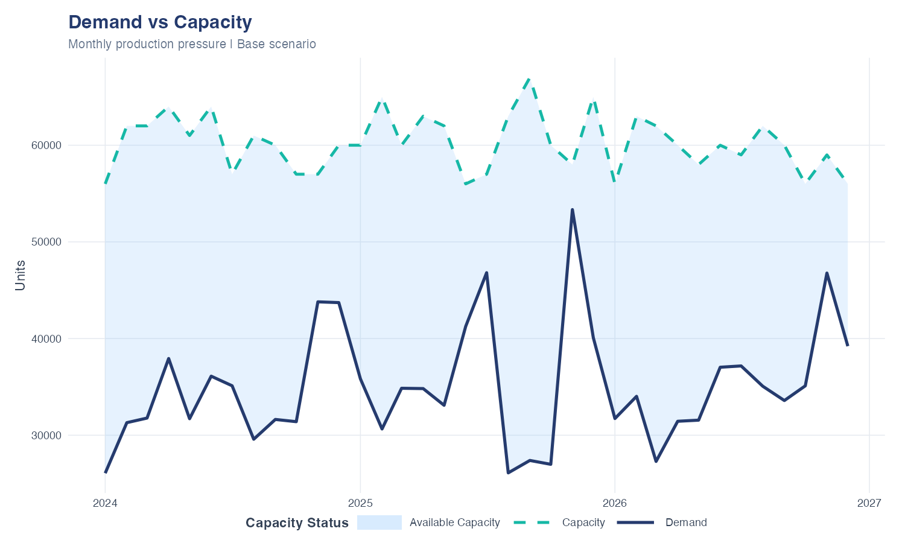
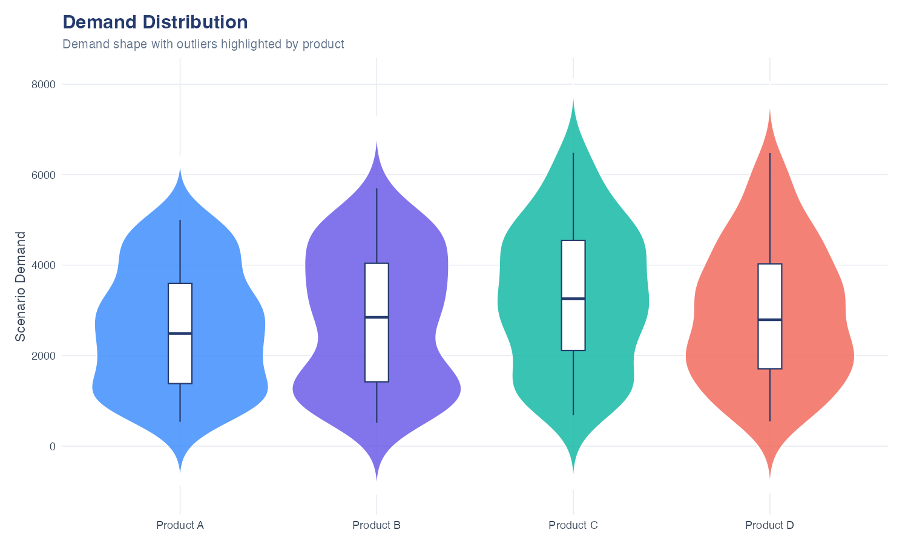
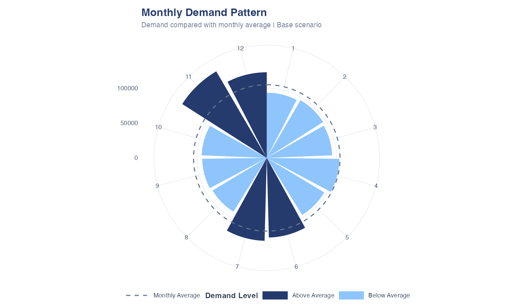
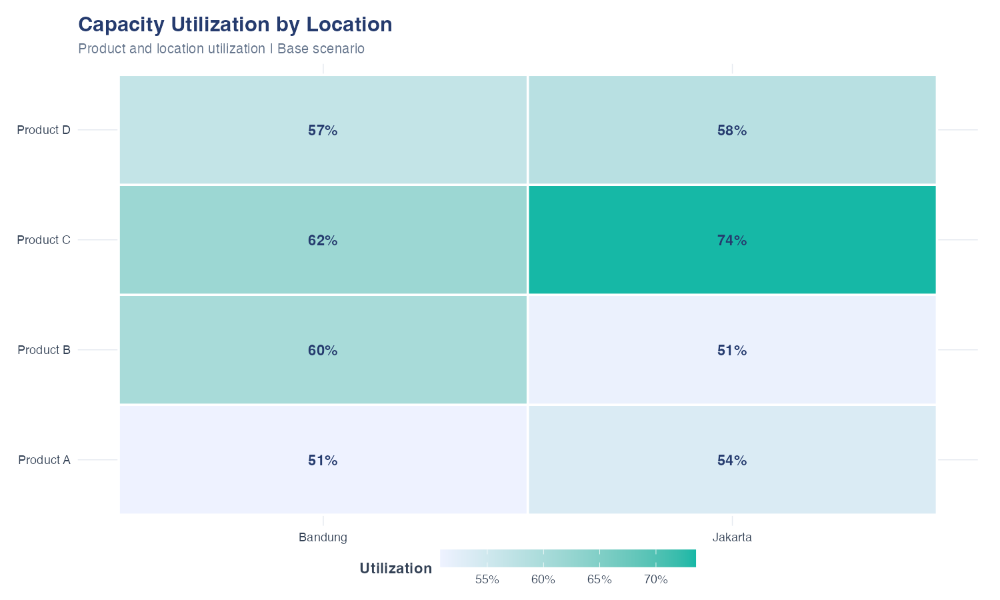
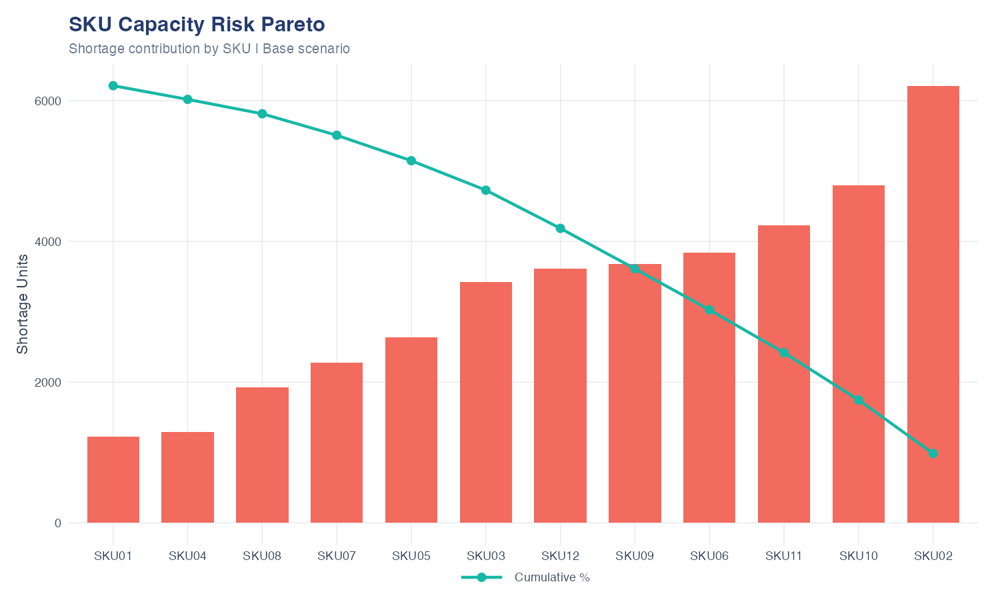
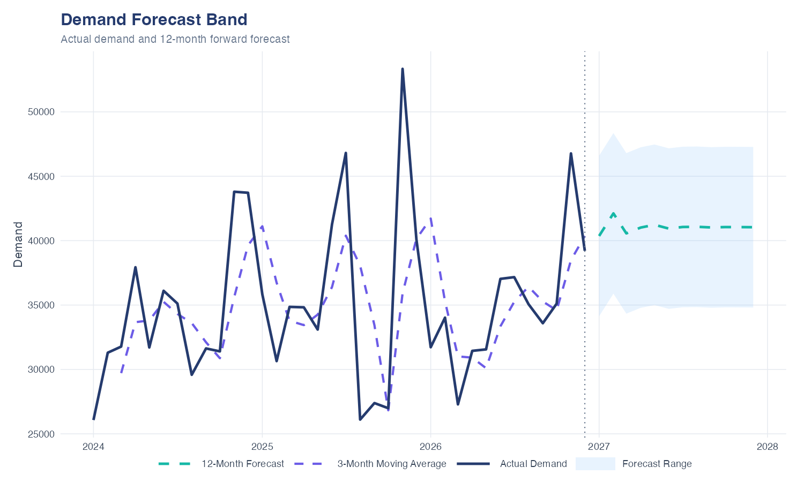

# Demand & Capacity What-If Analysis

End-to-end analytics project menggunakan **R + Power BI** untuk menganalisis demand, production capacity, What-If scenario, capacity risk, revenue impact, dan demand forecasting.

> **Business Question:**  
> **How does demand uncertainty affect production capacity and revenue?**

## 1. Project Flow

```text
Dataset
   ↓
Transformation 1 — Prepare Data
   ↓
Transformation 2 — Aggregate Demand
   ↓
Transformation 3 — Generate What-If Scenarios
   ↓
demand_final
   ↓
R Visualization & Forecasting
   ↓
Power BI Dashboard
   ↓
Business Decision
```

## 2. Dataset

Synthetic monthly dataset untuk periode **January 2024 – December 2026**, dengan 12 SKU, 4 products, 2 locations, dan beberapa product attributes.

**Dimensions**

```text
Tanggal | SKU | Produk | Kategori | Rasa
Ukuran | Packing | Lokasi | Tahun | Bulan
```

**Metrics**

```text
Permintaan | Harga | Kapasitas
```

```r
library(dplyr)
library(ggplot2)

set.seed(123)

dataset <- expand.grid(
  Tanggal = seq(as.Date("2024-01-01"), as.Date("2026-12-01"), by = "month"),
  SKU = paste0("SKU", sprintf("%02d", 1:12))
) |>
  mutate(
    Tahun = as.integer(format(Tanggal, "%Y")),
    Bulan = as.integer(format(Tanggal, "%m")),
    NamaBulan = format(Tanggal, "%B"),
    Produk = rep(c("Product A","Product B","Product C","Product D"), length.out = n()),
    Kategori = ifelse(Produk %in% c("Product A","Product B"), "Food", "Drink"),
    Rasa = sample(c("Chocolate","Berry","Vanilla","Original"), n(), replace = TRUE),
    Ukuran = sample(c("Small","Medium","Large"), n(), replace = TRUE),
    Packing = sample(c("Box","Bottle"), n(), replace = TRUE),
    Lokasi = sample(c("Jakarta","Bandung"), n(), replace = TRUE),
    Permintaan = round(
      runif(n(), 500, 5000) *
        case_when(
          Bulan %in% c(11,12) ~ 1.30,
          Bulan %in% c(6,7) ~ 1.15,
          TRUE ~ 1
        )
    ),
    Harga = sample(c(5000,7500,10000,15000), n(), replace = TRUE),
    Kapasitas = sample(c(4000,5000,6000), n(), replace = TRUE)
  )
```

## 3. Transformation 1 — Prepare Data

Membuat monthly analytical date dan menghitung demand value.

```r
step1 <- dataset |>
  mutate(
    TahunBulan = as.Date(paste(Tahun, sprintf("%02d", Bulan), "01", sep = "-")),
    DemandValue = Permintaan * Harga
  )

output <- step1
```

Output:

```text
TahunBulan
DemandValue
```

[Download step1_prepared.csv](dataset/step1_prepared.csv)

## 4. Transformation 2 — Aggregate Demand

Data diagregasi berdasarkan time, SKU, product, attributes, dan location.

```r
# Transformation 2 — Aggregate Demand
# Pastikan dplyr tersedia pada instalasi R yang digunakan Power BI.
suppressPackageStartupMessages(library(dplyr))

step2 <- step1 |>
  mutate(
    # Jangan memakai format(TahunBulan, ...) karena TahunBulan dari
    # Power BI dapat berupa object Microsoft.OleDb.Date.
    # Bangun ulang tanggal dari Tahun dan Bulan agar stabil.
    TahunBulan_R = as.Date(
      sprintf("%04d-%02d-01", as.integer(Tahun), as.integer(Bulan))
    )
  ) |>
  group_by(
    TahunBulan_R, Tahun, Bulan, NamaBulan, SKU, Produk,
    Kategori, Rasa, Ukuran, Packing, Lokasi
  ) |>
  summarise(
    Demand = sum(Permintaan, na.rm = TRUE),
    DemandValue = sum(DemandValue, na.rm = TRUE),
    Capacity = mean(Kapasitas, na.rm = TRUE),
    Harga = mean(Harga, na.rm = TRUE),
    .groups = "drop"
  ) |>
  ungroup()

# Kembalikan dengan nama kolom TahunBulan sebagai teks ISO.
output <- step2 |>
  mutate(
    TahunBulan = sprintf("%04d-%02d-01", as.integer(Tahun), as.integer(Bulan))
  ) |>
  select(
    TahunBulan, Tahun, Bulan, NamaBulan, SKU, Produk,
    Kategori, Rasa, Ukuran, Packing, Lokasi,
    Demand, DemandValue, Capacity, Harga
  ) |>
  as.data.frame(stringsAsFactors = FALSE)
```

> Di Power Query, ubah kembali `TahunBulan` menjadi tipe **Date** dengan `Transform → Data Type → Date`.

[Download step2_aggregated.csv](dataset/step2_aggregated.csv)

## 5. Transformation 3 — Generate What-If Scenarios

Scenario dibuat sebagai **rows**, bukan sebagai banyak scenario columns.

```text
-30% | -20% | -10% | Base | +10% | +20% | +30%
```

```r
scenarios <- data.frame(
  Scenario = c("-30%", "-20%", "-10%", "Base", "+10%", "+20%", "+30%"),
  Growth = c(-0.30, -0.20, -0.10, 0.00, 0.10, 0.20, 0.30)
)

demand_final <- merge(step2, scenarios) |>
  mutate(
    ScenarioDemand = Demand * (1 + Growth),
    ScenarioValue = ScenarioDemand * Harga,
    Utilization = ScenarioDemand / Capacity,
    CapacityGap = Capacity - ScenarioDemand,
    RevenueImpact = ScenarioValue - DemandValue
  )

output <- demand_final
```

Final analytical table:

```text
demand_final
```

[Download demand_final.csv](dataset/demand_final.csv)

Key metrics:

```text
Demand
DemandValue
Capacity
Scenario
Growth
ScenarioDemand
ScenarioValue
Utilization
CapacityGap
RevenueImpact
```

Interpretation:

```text
CapacityGap > 0  → Available Capacity
CapacityGap = 0  → Fully Utilized
CapacityGap < 0  → Production Shortage
```


## 6. R Analytics & Visualization

### Demand vs Capacity

Membandingkan demand dan capacity dari waktu ke waktu.

```r
library(dplyr)
library(ggplot2)

demand_final |>
  group_by(TahunBulan) |>
  summarise(
    Demand = sum(ScenarioDemand),
    Capacity = sum(Capacity),
    .groups = "drop"
  ) |>
  ggplot(aes(x = TahunBulan)) +
  geom_line(aes(y = Demand, linetype = "Demand"), linewidth = 1.2) +
  geom_line(aes(y = Capacity, linetype = "Capacity"), linewidth = 1.2) +
  labs(
    title = "Demand vs Capacity",
    subtitle = "Monthly production pressure under selected scenario",
    x = NULL, y = "Units", linetype = NULL
  ) +
  theme_minimal()
```



*Demand solid line, capacity dashed line, area coral menunjukkan production shortage, dan area biru muda menunjukkan available capacity.*

**Insight:** ketika `Demand > Capacity`, terdapat potensi production shortage.

### Violin Plot — Demand Distribution

```r
ggplot(demand_final, aes(x = Produk, y = ScenarioDemand, fill = Produk)) +
  geom_violin(alpha = .7, trim = FALSE) +
  geom_boxplot(width = .12, fill = "white") +
  labs(
    title = "Demand Distribution",
    subtitle = "Demand shape by product",
    x = NULL, y = "Scenario Demand"
  ) +
  theme_minimal()
```



*Violin menunjukkan bentuk distribusi demand; titik gold menunjukkan outlier yang terdeteksi.*

Digunakan untuk melihat bentuk distribusi demand.

### Polar Seasonality

```r
demand_final |>
  group_by(Bulan) |>
  summarise(Demand = sum(ScenarioDemand), .groups = "drop") |>
  ggplot(aes(x = Bulan, y = Demand)) +
  geom_col(width = .9, fill = "steelblue") +
  coord_polar() +
  scale_x_continuous(breaks = 1:12) +
  labs(
    title = "Monthly Demand Pattern",
    subtitle = "Selected scenario"
  ) +
  theme_minimal()
```



*Biru tua menunjukkan demand di atas rata-rata, biru muda menunjukkan demand di bawah rata-rata, dan garis putus-putus menunjukkan monthly average.*

Menunjukkan pola demand bulanan dan seasonality.

### Capacity Utilization Heatmap

```r
demand_final |>
  group_by(Produk, Lokasi) |>
  summarise(
    Utilization = sum(ScenarioDemand) / sum(Capacity),
    .groups = "drop"
  ) |>
  ggplot(aes(x = Lokasi, y = Produk, fill = Utilization)) +
  geom_tile() +
  geom_text(aes(label = paste0(round(Utilization * 100), "%"))) +
  labs(
    title = "Capacity Utilization by Location",
    subtitle = "Selected scenario",
    x = NULL, y = NULL
  ) +
  theme_minimal()
```



*Warna yang semakin kuat menunjukkan utilization yang semakin tinggi pada kombinasi product dan location.*

Menganalisis utilization berdasarkan **Product × Location**.

### Pareto — SKU Capacity Risk

```r
demand_final |>
  group_by(SKU) |>
  summarise(Shortage = sum(pmax(-CapacityGap, 0)), .groups = "drop") |>
  arrange(desc(Shortage)) |>
  mutate(CumPct = cumsum(Shortage) / sum(Shortage) * 100) |>
  ggplot(aes(x = reorder(SKU, Shortage), y = Shortage)) +
  geom_col() +
  geom_line(
    aes(y = CumPct / 100 * max(Shortage), group = 1),
    linewidth = 1
  ) +
  geom_point(
    aes(y = CumPct / 100 * max(Shortage)),
    size = 3
  ) +
  labs(
    title = "SKU Capacity Risk Pareto",
    subtitle = "SKUs contributing to production shortage",
    x = NULL, y = "Shortage Units"
  ) +
  theme_minimal()
```



*Bar coral menunjukkan shortage per SKU, sedangkan garis aqua menunjukkan cumulative shortage contribution.*

Mengidentifikasi SKU yang paling berkontribusi terhadap production shortage.

## 7. Demand Forecast

Forecast menggunakan **3-Month Moving Average** dan **12-Month Forward Forecast**.

```r
library(dplyr)
library(ggplot2)
library(lubridate)

# Historical data
df <- demand_final |>
  group_by(TahunBulan) |>
  summarise(Demand = sum(ScenarioDemand), .groups = "drop") |>
  arrange(TahunBulan)

# 3-month moving average
df <- df |>
  mutate(
    Forecast = (Demand + lag(Demand) + lag(Demand, 2)) / 3
  )

# 12-Month Forecast
future <- data.frame(
  TahunBulan = seq(
    max(df$TahunBulan) %m+% months(1),
    max(df$TahunBulan) %m+% months(12),
    by = "month"
  )
)

future$Forecast <- NA

# Forecast month by month
for (i in 1:12) {
  values <- c(
    tail(df$Demand, 3),
    future$Forecast[1:(i - 1)]
  )

  future$Forecast[i] <- mean(
    tail(values, 3),
    na.rm = TRUE
  )
}

# Forecast range
sd_demand <- sd(df$Demand, na.rm = TRUE)

future <- future |>
  mutate(
    Upper = Forecast + sd_demand,
    Lower = Forecast - sd_demand
  )

# Chart
ggplot() +
  geom_ribbon(
    data = future,
    aes(x = TahunBulan, ymin = Lower, ymax = Upper, fill = "Forecast Range"),
    alpha = 0.2
  ) +
  geom_line(
    data = df,
    aes(x = TahunBulan, y = Demand, color = "Actual Demand"),
    linewidth = 1
  ) +
  geom_line(
    data = df,
    aes(x = TahunBulan, y = Forecast, color = "3-Month Moving Average"),
    linewidth = 1
  ) +
  geom_line(
    data = future,
    aes(x = TahunBulan, y = Forecast, color = "12-Month Forecast"),
    linewidth = 1.3
  ) +
  geom_vline(
    xintercept = max(df$TahunBulan),
    linetype = 2
  ) +
  labs(
    title = "Demand Forecast Band",
    subtitle = "Actual demand with 12-month forward forecast",
    x = NULL, y = "Demand", color = NULL, fill = NULL
  ) +
  theme_minimal() +
  theme(
    plot.title = element_text(size = 16, face = "bold"),
    plot.subtitle = element_text(size = 11),
    axis.text = element_text(size = 9),
    axis.title = element_text(size = 11),
    legend.text = element_text(size = 9),
    legend.position = "bottom"
  )
```



*Actual Demand ditampilkan sebagai garis solid; 3-Month Moving Average dan 12-Month Forecast sebagai garis dashed; area biru muda menunjukkan forecast range.*

Forecast terdiri dari:

```text
Actual Demand
3-Month Moving Average
12-Month Forecast
Forecast Range
```

## 8. Power BI Dashboard

Final table:

```text
demand_final
```

digunakan sebagai single source untuk Power BI.

Gunakan:

```text
Scenario → Slicer
```

Scenario:

```text
-30%
-20%
-10%
Base
+10%
+20%
+30%
```

Slicer mengontrol:

```text
ScenarioDemand
ScenarioValue
Utilization
CapacityGap
RevenueImpact
```

### Page 1 — Demand & Capacity

```text
KPI
Demand vs Capacity
Polar Seasonality
SKU Demand
Capacity Utilization
Scenario Slicer
```

### Page 2 — Risk & Forecast

```text
Demand Variability
Demand Distribution
SKU Capacity Risk Pareto
12-Month Forecast
Scenario Slicer
```

## 9. Business Framework

```text
Demand
  ↓
What-If Scenario
  ↓
Scenario Demand
  ↓
Capacity
  ↓
Utilization
  ↓
Capacity Gap
  ↓
SKU Risk
  ↓
Revenue Impact
  ↓
Forecast
  ↓
Business Decision
```

Project menjawab:

> **If demand changes under different scenarios, can our production capacity handle it, which SKUs are at risk, and what will be the potential financial impact?**

## 10. Technology Stack

| Technology | Purpose                                                   |
| ---------- | --------------------------------------------------------- |
| R          | Data generation, transformation, analysis & visualization |
| dplyr      | Data manipulation                                         |
| ggplot2    | Visualization                                             |
| lubridate  | Date manipulation & forecasting                           |
| Power BI   | Interactive dashboard                                     |

## 11. Final Output

```text
dataset
   ↓
step1
   ↓
step2
   ↓
demand_final
   ↓
R Analytics & Forecast
   ↓
Power BI
```

`demand_final` menjadi single analytical dataset yang menggabungkan:

```text
Demand
+
Capacity
+
What-If Scenario
+
Revenue Impact
+
Risk Analysis
+
Forecasting
```

Dengan **3 transformation utama** dan pendekatan **Scenario-as-Rows**, project ini menyediakan framework sederhana dan fleksibel untuk **Demand Planning, Capacity Planning, Production Planning, dan What-If Business Analysis**.
