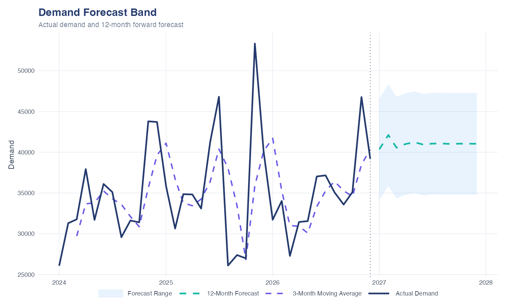

# Demand & Capacity What-If Analysis

End-to-end analytics project menggunakan **R + Power BI** untuk menganalisis demand, production capacity, What-If scenario, capacity risk, revenue impact, dan demand forecasting.

> **Business Question:**  
> **How does demand uncertainty affect production capacity and revenue?**

## 1. Project Flow

```text
Dataset
   ↓
Transformation 1 — Prepare & Aggregate Data
   ↓
Transformation 2 — Generate What-If Scenarios
   ↓
demand_final
   ↓
R Visualization & Forecasting
   ↓
Power BI Dashboard
   ↓
Business Decision
```

## 2. Dataset

Synthetic monthly dataset untuk periode **January 2024 – December 2026**, dengan 12 SKU, 4 products, 2 locations, dan beberapa product attributes.

**Dimensions**

```text
Tanggal | SKU | Produk | Kategori | Rasa
Ukuran | Packing | Lokasi | Tahun | Bulan
```

**Metrics**

```text
Permintaan | Harga | Kapasitas
```

```r
library(dplyr)
library(ggplot2)

set.seed(123)

dataset <- expand.grid(
  Tanggal = seq(as.Date("2024-01-01"), as.Date("2026-12-01"), by = "month"),
  SKU = paste0("SKU", sprintf("%02d", 1:12))
) |>
  mutate(
    Tahun = as.integer(format(Tanggal, "%Y")),
    Bulan = as.integer(format(Tanggal, "%m")),
    NamaBulan = format(Tanggal, "%B"),
    Produk = rep(c("Product A","Product B","Product C","Product D"), length.out = n()),
    Kategori = ifelse(Produk %in% c("Product A","Product B"), "Food", "Drink"),
    Rasa = sample(c("Chocolate","Berry","Vanilla","Original"), n(), replace = TRUE),
    Ukuran = sample(c("Small","Medium","Large"), n(), replace = TRUE),
    Packing = sample(c("Box","Bottle"), n(), replace = TRUE),
    Lokasi = sample(c("Jakarta","Bandung"), n(), replace = TRUE),
    Permintaan = round(
      runif(n(), 500, 5000) *
        case_when(
          Bulan %in% c(11,12) ~ 1.30,
          Bulan %in% c(6,7) ~ 1.15,
          TRUE ~ 1
        )
    ),
    Harga = sample(c(5000,7500,10000,15000), n(), replace = TRUE),
    Kapasitas = sample(c(4000,5000,6000), n(), replace = TRUE)
  )
```

## 3. Transformation 1 — Prepare & Aggregate Data

Transformation ini menggabungkan proses prepare data dan aggregate demand. Kolom `TahunBulan` dibuat dari `Tahun` dan `Bulan`, kemudian `DemandValue` dihitung sebelum data diagregasi.

```r
library(dplyr)

step2 <- dataset |>
  mutate(
    TahunBulan = as.Date(
      paste(Tahun, sprintf("%02d", Bulan), "01", sep = "-")
    ),
    DemandValue = Permintaan * Harga
  ) |>
  group_by(
    TahunBulan, Tahun, Bulan, NamaBulan, SKU, Produk,
    Kategori, Rasa, Ukuran, Packing, Lokasi
  ) |>
  summarise(
    Demand = sum(Permintaan, na.rm = TRUE),
    DemandValue = sum(DemandValue, na.rm = TRUE),
    Capacity = mean(Kapasitas, na.rm = TRUE),
    Harga = mean(Harga, na.rm = TRUE),
    .groups = "drop"
  )

output <- step2 |>
  mutate(
    # Kirim sebagai string YYYY-MM agar Power BI tidak menerima Microsoft.OleDb.Date.
    TahunBulan = sprintf("%04d-%02d", as.integer(Tahun), as.integer(Bulan))
  )
```

Output utama:

```text
TahunBulan
Demand
DemandValue
Capacity
Harga
```

[Download step2_aggregated.csv](dataset/step2_aggregated.csv)

## 4. Transformation 2 — Generate What-If Scenarios

Scenario dibuat sebagai **rows**, bukan sebagai banyak scenario columns.

```text
-30% | -20% | -10% | Base | +10% | +20% | +30%
```

```r
library(dplyr)

scenarios <- data.frame(
  Scenario = c("-30%", "-20%", "-10%", "Base", "+10%", "+20%", "+30%"),
  Growth = c(-0.30, -0.20, -0.10, 0.00, 0.10, 0.20, 0.30)
)

demand_final <- merge(step2, scenarios) |>
  mutate(
    ScenarioDemand = Demand * (1 + Growth),
    ScenarioValue = ScenarioDemand * Harga,
    Utilization = ScenarioDemand / Capacity,
    CapacityGap = Capacity - ScenarioDemand,
    RevenueImpact = ScenarioValue - DemandValue
  )

output <- demand_final |>
  mutate(
    # Pastikan output final juga berupa string YYYY-MM.
    TahunBulan = sprintf("%04d-%02d", as.integer(Tahun), as.integer(Bulan))
  )
```

Final analytical table:

```text
demand_final
```

[Download demand_final.csv](dataset/demand_final.csv)

Key metrics:

```text
Demand
DemandValue
Capacity
Scenario
Growth
ScenarioDemand
ScenarioValue
Utilization
CapacityGap
RevenueImpact
```

Interpretation:

```text
CapacityGap > 0  → Available Capacity
CapacityGap = 0  → Fully Utilized
CapacityGap < 0  → Production Shortage
```


## 5. R Analytics & Visualization

### Violin Plot — Demand Distribution

```r
library(dplyr)
library(ggplot2)

COLORS <- list(navy = "#253B6E", gold = "#F2B134", white = "#FFFFFF", text = "#334155")
PRODUCT_COLORS <- c("Product A" = "#3F8EFC", "Product B" = "#6C5CE7", "Product C" = "#16B8A6", "Product D" = "#F26B5E")

selected_scenario <- if ("Scenario" %in% names(demand_final)) {
  scenarios_in_visual <- unique(na.omit(as.character(demand_final$Scenario)))
  if (length(scenarios_in_visual) == 1) scenarios_in_visual else "Base"
} else {
  "Base"
}
visual_data <- demand_final |> filter(Scenario == selected_scenario)

ggplot(visual_data, aes(Produk, ScenarioDemand, fill = Produk)) +
  geom_violin(color = COLORS$white, alpha = .85, trim = FALSE) +
  geom_boxplot(width = .12, fill = COLORS$white, color = COLORS$navy,
               outlier.shape = 21, outlier.fill = COLORS$gold,
               outlier.color = COLORS$navy, outlier.size = 2.4,
               outlier.stroke = .5) +
  scale_fill_manual(values = PRODUCT_COLORS, guide = "none") +
  labs(title = "Demand Distribution", subtitle = "Demand shape with outliers highlighted by product", x = NULL, y = "Scenario Demand") +
  theme_minimal(base_size = 11) +
  theme(plot.title = element_text(face = "bold", size = 15, color = COLORS$navy),
        plot.subtitle = element_text(size = 10, color = COLORS$text),
        panel.grid.minor = element_blank())
```


*Violin menunjukkan bentuk distribusi demand; titik gold menunjukkan outlier yang terdeteksi.*

Digunakan untuk melihat bentuk distribusi demand.

### Polar Seasonality

```r
library(dplyr)
library(ggplot2)

COLORS <- list(navy = "#253B6E", sky = "#8EC5FC", slate = "#64748B", white = "#FFFFFF", text = "#334155")
selected_scenario <- if ("Scenario" %in% names(demand_final)) {
  scenarios_in_visual <- unique(na.omit(as.character(demand_final$Scenario)))
  if (length(scenarios_in_visual) == 1) scenarios_in_visual else "Base"
} else {
  "Base"
}
visual_data <- demand_final |> filter(Scenario == selected_scenario)

seasonality <- visual_data |>
  group_by(Bulan) |>
  summarise(Demand = sum(ScenarioDemand), .groups = "drop") |>
  mutate(AverageDemand = mean(Demand), DemandLevel = if_else(Demand >= AverageDemand, "Above Average", "Below Average"))

ggplot(seasonality, aes(Bulan, Demand)) +
  geom_col(aes(fill = DemandLevel), width = .9) +
  geom_hline(aes(yintercept = AverageDemand, linetype = "Monthly Average"), color = COLORS$slate, linewidth = .7) +
  scale_fill_manual(values = c("Above Average" = COLORS$navy, "Below Average" = COLORS$sky), name = "Demand Level") +
  scale_linetype_manual(values = c("Monthly Average" = "dashed"), name = NULL) +
  coord_polar() + scale_x_continuous(breaks = 1:12) +
  labs(title = "Monthly Demand Pattern", subtitle = "Demand compared with monthly average | Base scenario", x = NULL, y = NULL) +
  theme_minimal(base_size = 11) +
  theme(plot.title = element_text(face = "bold", size = 15, color = COLORS$navy),
        plot.subtitle = element_text(size = 10, color = COLORS$text),
        panel.grid.minor = element_blank(), legend.position = "bottom")
```


*Biru tua menunjukkan demand di atas rata-rata, biru muda menunjukkan demand di bawah rata-rata, dan garis putus-putus menunjukkan monthly average.*

Menunjukkan pola demand bulanan dan seasonality.

### Capacity Utilization Heatmap

```r
library(dplyr)
library(ggplot2)

COLORS <- list(navy = "#253B6E", aqua = "#16B8A6", white = "#FFFFFF", text = "#334155")
selected_scenario <- if ("Scenario" %in% names(demand_final)) {
  scenarios_in_visual <- unique(na.omit(as.character(demand_final$Scenario)))
  if (length(scenarios_in_visual) == 1) scenarios_in_visual else "Base"
} else {
  "Base"
}
visual_data <- demand_final |> filter(Scenario == selected_scenario)

utilization <- visual_data |>
  group_by(Produk, Lokasi) |>
  summarise(Utilization = sum(ScenarioDemand) / sum(Capacity), .groups = "drop")

ggplot(utilization, aes(Lokasi, Produk, fill = Utilization)) +
  geom_tile(color = COLORS$white, linewidth = .8) +
  geom_text(aes(label = paste0(round(Utilization * 100), "%")), color = COLORS$navy, fontface = "bold") +
  scale_fill_gradient(low = "#EEF2FF", high = COLORS$aqua, labels = scales::percent, name = "Utilization") +
  labs(title = "Capacity Utilization by Location", subtitle = "Product and location utilization | Base scenario", x = NULL, y = NULL) +
  theme_minimal(base_size = 11) +
  theme(plot.title = element_text(face = "bold", size = 15, color = COLORS$navy),
        plot.subtitle = element_text(size = 10, color = COLORS$text),
        panel.grid = element_blank(), legend.position = "bottom")
```


*Warna yang semakin kuat menunjukkan utilization yang semakin tinggi pada kombinasi product dan location.*

Menganalisis utilization berdasarkan **Product × Location**.

### Pareto — SKU Capacity Risk

```r
library(dplyr)
library(ggplot2)

COLORS <- list(aqua = "#16B8A6", coral = "#F26B5E", navy = "#253B6E", text = "#334155")
selected_scenario <- if ("Scenario" %in% names(demand_final)) {
  scenarios_in_visual <- unique(na.omit(as.character(demand_final$Scenario)))
  if (length(scenarios_in_visual) == 1) scenarios_in_visual else "Base"
} else {
  "Base"
}
visual_data <- demand_final |> filter(Scenario == selected_scenario)

risk <- visual_data |>
  group_by(SKU) |>
  summarise(Shortage = sum(pmax(-CapacityGap, 0)), .groups = "drop") |>
  arrange(desc(Shortage)) |>
  mutate(CumPct = if (sum(Shortage) > 0) cumsum(Shortage) / sum(Shortage) * 100 else 0)
max_shortage <- max(risk$Shortage, 1)

ggplot(risk, aes(reorder(SKU, Shortage), Shortage)) +
  geom_col(fill = COLORS$coral, width = .7) +
  geom_line(aes(y = CumPct / 100 * max_shortage, group = 1, color = "Cumulative %"), linewidth = 1) +
  geom_point(aes(y = CumPct / 100 * max_shortage, color = "Cumulative %"), size = 2.5) +
  scale_color_manual(values = c("Cumulative %" = COLORS$aqua), name = NULL) +
  labs(title = "SKU Capacity Risk Pareto", subtitle = "Shortage contribution by SKU | Base scenario", x = NULL, y = "Shortage Units") +
  theme_minimal(base_size = 11) +
  theme(plot.title = element_text(face = "bold", size = 15, color = COLORS$navy),
        plot.subtitle = element_text(size = 10, color = COLORS$text), legend.position = "bottom")
```


*Bar coral menunjukkan shortage per SKU, sedangkan garis aqua menunjukkan cumulative shortage contribution.*

Mengidentifikasi SKU yang paling berkontribusi terhadap production shortage.

### Dynamic Scenario Slicer untuk R Visual

Agar visual mengikuti slicer Power BI tetapi tetap default ke `Base`:

1. Tambahkan kolom `Scenario` dari `demand_final` ke **Slicer**.
2. Pilih hanya `Base` sebagai default selection pada slicer.
3. Tambahkan field yang dibutuhkan visual R ke bagian **Values**.
4. Jangan gunakan `filter(Scenario == "Base")` secara hard-coded pada kode visual.

Kode visual menggunakan pola berikut:

```r
library(dplyr)

selected_scenario <- if ("Scenario" %in% names(demand_final)) {
  scenarios_in_visual <- unique(na.omit(as.character(demand_final$Scenario)))
  if (length(scenarios_in_visual) == 1) scenarios_in_visual else "Base"
} else {
  "Base"
}

visual_data <- demand_final |>
  filter(Scenario == selected_scenario)
```

Perilaku visual:

```text
Slicer = Base          → visual Base
Slicer = +10%          → visual +10%
Slicer = +30%          → visual +30%
Tidak ada filter       → fallback Base
Multiple scenario      → fallback Base
```

> Catatan: kode `generate_outputs.R` menghasilkan PNG statis dengan `Base` sebagai scenario default. Slicer dinamis berlaku untuk R Visual yang dijalankan di Power BI dan menerima data terfilter dari Power BI.

Forecast menggunakan **3-Month Moving Average** dan **12-Month Forward Forecast**.

```r
library(dplyr)
library(ggplot2)
library(lubridate)

COLORS <- list(navy = "#253B6E", violet = "#6C5CE7", aqua = "#16B8A6", sky = "#8EC5FC", slate = "#64748B", text = "#334155", white = "#FFFFFF")
selected_scenario <- if ("Scenario" %in% names(demand_final)) {
  scenarios_in_visual <- unique(na.omit(as.character(demand_final$Scenario)))
  if (length(scenarios_in_visual) == 1) scenarios_in_visual else "Base"
} else {
  "Base"
}
visual_data <- demand_final |> filter(Scenario == selected_scenario)

monthly <- visual_data |>
  mutate(
    TahunBulan = as.Date(paste0(TahunBulan, "-01"))
  ) |>
  group_by(TahunBulan) |>
  summarise(Demand = sum(ScenarioDemand), Capacity = sum(Capacity), .groups = "drop") |>
  arrange(TahunBulan)

df <- monthly |>
  mutate(Forecast = (Demand + lag(Demand) + lag(Demand, 2)) / 3)
future <- tibble(TahunBulan = seq(max(df$TahunBulan) %m+% months(1), max(df$TahunBulan) %m+% months(12), by = "month"), Forecast = NA_real_)
for (i in seq_len(nrow(future))) {
  values <- c(tail(df$Demand, 3), future$Forecast[seq_len(i - 1)])
  future$Forecast[i] <- mean(tail(values, 3), na.rm = TRUE)
}
sd_demand <- sd(df$Demand, na.rm = TRUE)
future <- future |> mutate(Upper = Forecast + sd_demand, Lower = Forecast - sd_demand)

ggplot() +
  geom_ribbon(data = future, aes(TahunBulan, ymin = Lower, ymax = Upper, fill = "Forecast Range"), alpha = .2) +
  geom_line(data = df |> filter(!is.na(Forecast)), aes(TahunBulan, Forecast, color = "3-Month Moving Average", linetype = "3-Month Moving Average"), linewidth = .95) +
  geom_line(data = df, aes(TahunBulan, Demand, color = "Actual Demand", linetype = "Actual Demand"), linewidth = 1.1) +
  geom_line(data = future, aes(TahunBulan, Forecast, color = "12-Month Forecast", linetype = "12-Month Forecast"), linewidth = 1.1) +
  geom_vline(xintercept = max(df$TahunBulan), linetype = "dotted", color = COLORS$slate) +
  scale_color_manual(values = c("Actual Demand" = COLORS$navy, "3-Month Moving Average" = COLORS$violet, "12-Month Forecast" = COLORS$aqua), name = NULL) +
  scale_linetype_manual(values = c("Actual Demand" = "solid", "3-Month Moving Average" = "dashed", "12-Month Forecast" = "dashed"), name = NULL) +
  scale_fill_manual(values = c("Forecast Range" = COLORS$sky), name = NULL) +
  labs(title = "Demand Forecast Band", subtitle = "Actual demand and 12-month forward forecast", x = NULL, y = "Demand") +
  theme_minimal(base_size = 11) +
  theme(plot.title = element_text(face = "bold", size = 15, color = COLORS$navy),
        plot.subtitle = element_text(size = 10, color = COLORS$text),
        legend.position = "bottom")
```



*Actual Demand ditampilkan sebagai garis solid; 3-Month Moving Average dan 12-Month Forecast sebagai garis dashed; area biru muda menunjukkan forecast range.*

Forecast terdiri dari:

```text
Actual Demand
3-Month Moving Average
12-Month Forecast
Forecast Range
```

## 7. Power BI Dashboard

Final table:

```text
demand_final
```

digunakan sebagai single source untuk Power BI.

Gunakan:

```text
Scenario → Slicer
```

Scenario:

```text
-30%
-20%
-10%
Base
+10%
+20%
+30%
```

Slicer mengontrol:

```text
ScenarioDemand
ScenarioValue
Utilization
CapacityGap
RevenueImpact
```

### Page 1 — Demand & Capacity

```text
KPI
Demand vs Capacity
Polar Seasonality
SKU Demand
Capacity Utilization
Scenario Slicer
```

### Page 2 — Risk & Forecast

```text
Demand Variability
Demand Distribution
SKU Capacity Risk Pareto
12-Month Forecast
Scenario Slicer
```

## 8. Business Framework

```text
Demand
  ↓
What-If Scenario
  ↓
Scenario Demand
  ↓
Capacity
  ↓
Utilization
  ↓
Capacity Gap
  ↓
SKU Risk
  ↓
Revenue Impact
  ↓
Forecast
  ↓
Business Decision
```

Project menjawab:

> **If demand changes under different scenarios, can our production capacity handle it, which SKUs are at risk, and what will be the potential financial impact?**

## 9. Technology Stack

| Technology | Purpose                                                   |
| ---------- | --------------------------------------------------------- |
| R          | Data generation, transformation, analysis & visualization |
| dplyr      | Data manipulation                                         |
| ggplot2    | Visualization                                             |
| lubridate  | Date manipulation & forecasting                           |
| Power BI   | Interactive dashboard                                     |

## 10. Final Output

```text
dataset
   ↓
step2 (Prepare & Aggregate)
   ↓
demand_final
   ↓
R Analytics & Forecast
   ↓
Power BI
```

`demand_final` menjadi single analytical dataset yang menggabungkan:

```text
Demand
+
Capacity
+
What-If Scenario
+
Revenue Impact
+
Risk Analysis
+
Forecasting
```

Dengan **2 transformation utama** dan pendekatan **Scenario-as-Rows**, project ini menyediakan framework sederhana dan fleksibel untuk **Demand Planning, Capacity Planning, Production Planning, dan What-If Business Analysis**.
