# R + Power BI — Panduan Singkat `dplyr` & `ggplot2`

> **Project guide:** [Main README](README.md) · [R Basics](BASICR.MD) · [R Cheat Sheet](CHEATSEET.MD)


> **Sumber:** [Create Power BI visuals using R](https://learn.microsoft.com/en-us/power-bi/create-reports/desktop-r-visuals) · [Use R in Power Query Editor](https://learn.microsoft.com/en-us/power-bi/connect-data/desktop-r-in-query-editor). Semua screenshot di panduan ini berasal dari kedua artikel tersebut.

---

## 1. Ringkasan

| Tempat | Fungsi | Package |
| --- | --- | --- |
| Power Query Editor (`Transform → Run R script`) | mengubah bentuk data → tabel `output` | `dplyr` |
| R Visual (Visualization pane) | menggambar chart → gambar | `dplyr` + `ggplot2` |

```text
Power Query Editor  ->  data bersih  ->  Data model  ->  R Visual  ->  chart
```

> Power Query Editor hanya menerima **data frame** (`output`), sehingga `ggplot2` hanya dipakai di **R Visual**.

Data latihan: [`dataset/rpowerbi_practice.csv`](dataset/rpowerbi_practice.csv).

Contoh report: [`Demand & Capacity.pbix`](Demand%20%26%20Capacity.pbix) — satu halaman berisi 6 R Visual (`ggplot2`) dan slicer `Scenario`, `Kategori`, `Ukuran`, serta `Packing`.

---

## 2. Setup

Power BI Desktop tidak menyertakan engine R, jadi install R terpisah dari CRAN:

```r
install.packages(c("dplyr", "ggplot2", "scales"))
```

Aktifkan R di Power BI Desktop: **File → Options and settings → Options → Global → R scripting**, lalu pastikan path R muncul di **Detected R home directories**.


---

## 3. `dplyr` di Power Query Editor

**Alur:** Get data → Text/CSV → Load → Transform data → Transform → Run R script.


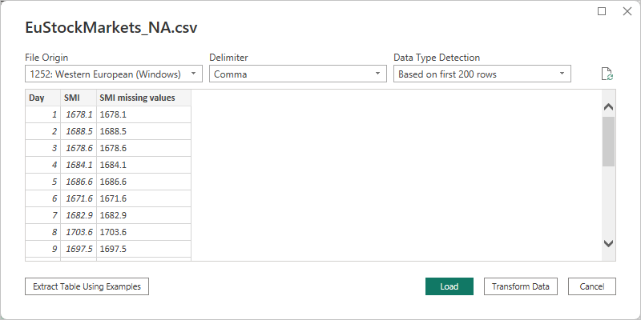


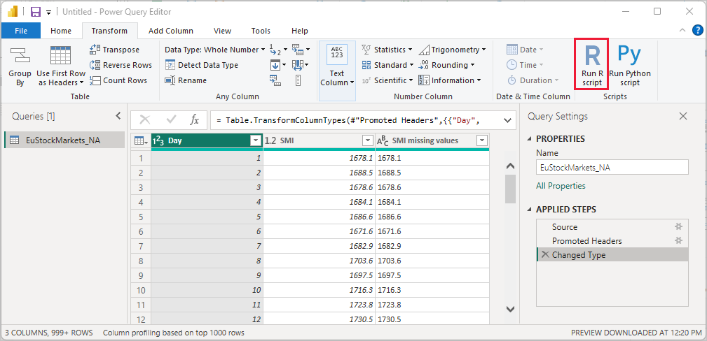

**Script** — `dataset` adalah input, `output` adalah hasil step ini:

```r
library(dplyr)

output <- dataset |>
  mutate(DemandValue = Permintaan * Harga) |>
  group_by(Tanggal, Produk) |>
  summarise(
    Demand      = sum(Permintaan, na.rm = TRUE),
    DemandValue = sum(DemandValue, na.rm = TRUE),
    .groups     = "drop"
  )
```

> Pertahankan `Tanggal` di `group_by()` jika ingin membuat chart time-series, agar kolomnya tidak hilang.

**Setelah OK:** pilih **Continue**, lalu set **Privacy levels = Public**.

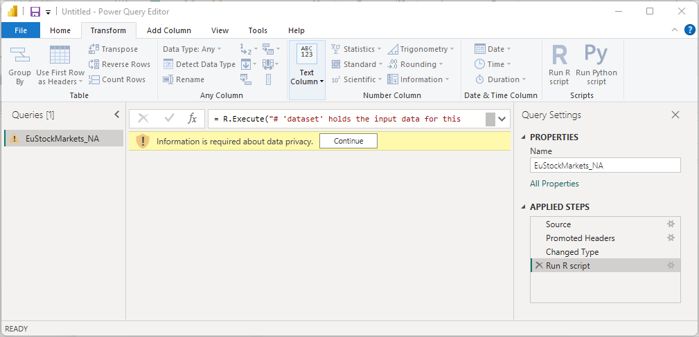

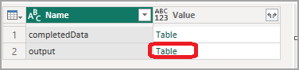


**Privacy level:** semua data source query R harus **Public** (File → Options and settings → Data source settings → Edit Permissions).


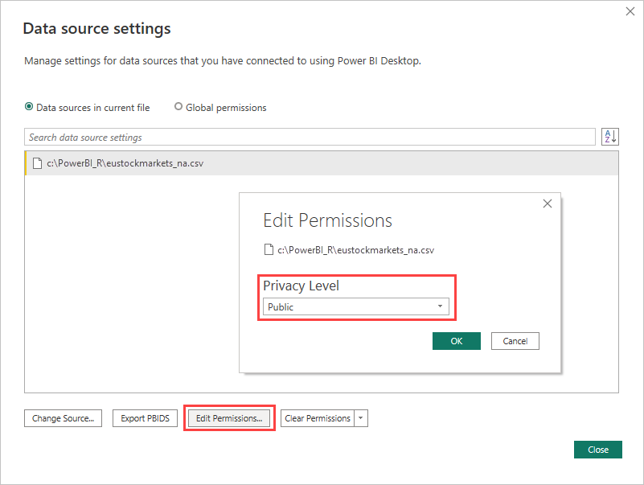

---

## 4. `dplyr` + `ggplot2` di R Visual

Tambah R Visual: pilih icon **R Visual**, lalu **Enable**.


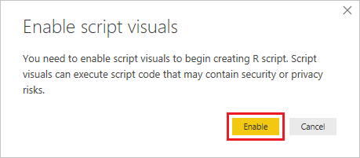

Field yang dipilih di **Values** dikirim sebagai data frame bernama `dataset`. Editor script dan kode binding tampil otomatis.

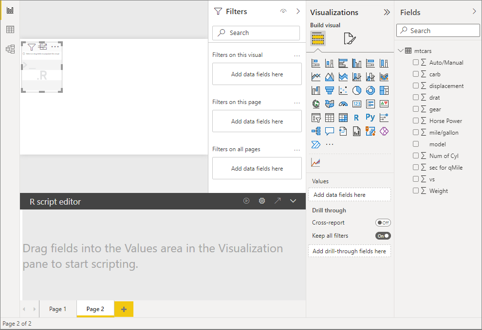
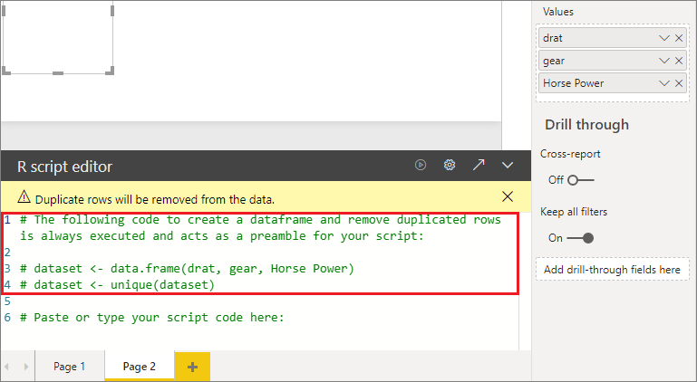

| Aturan | Keterangan |
| --- | --- |
| Nama data frame | selalu `dataset` |
| Agregasi | default **do not summarize** → agregasi sendiri dengan `dplyr` |
| Nama kolom | dirujuk dengan nama asli, mis. `dataset$Demand` |

### Contoh

**Bar — demand per produk**

```r
library(dplyr); library(ggplot2)

dataset |>
  group_by(Produk) |>
  summarise(Demand = sum(Demand, na.rm = TRUE), .groups = "drop") |>
  ggplot(aes(Produk, Demand)) +
  geom_col(fill = "#2c7fb8") +
  theme_minimal()
```

**Line — tren demand**

```r
dataset |>
  group_by(Tanggal) |>
  summarise(Demand = sum(Demand, na.rm = TRUE), .groups = "drop") |>
  ggplot(aes(as.Date(Tanggal), Demand)) +
  geom_line(color = "#2c7fb8") +
  theme_minimal()
```

**Heatmap — demand per produk & lokasi**

```r
dataset |>
  group_by(Produk, Lokasi) |>
  summarise(Demand = sum(Demand, na.rm = TRUE), .groups = "drop") |>
  ggplot(aes(Lokasi, Produk, fill = Demand)) +
  geom_tile(color = "white") +
  scale_fill_gradient(low = "#c6dbef", high = "#08519c") +
  theme_minimal()
```

**Ikuti slicer** (default `Base`):

```r
sc <- unique(dataset$Scenario)
dataset <- dataset |> filter(Scenario == if (length(sc) == 1) sc else "Base")
```

Jika script error, pesan tampil di canvas — pilih **See details**.


---

## 5. Contoh Resmi Microsoft

Alurnya sama seperti di atas; contoh Microsoft memakai package `corrplot` (padanan `ggplot2`).

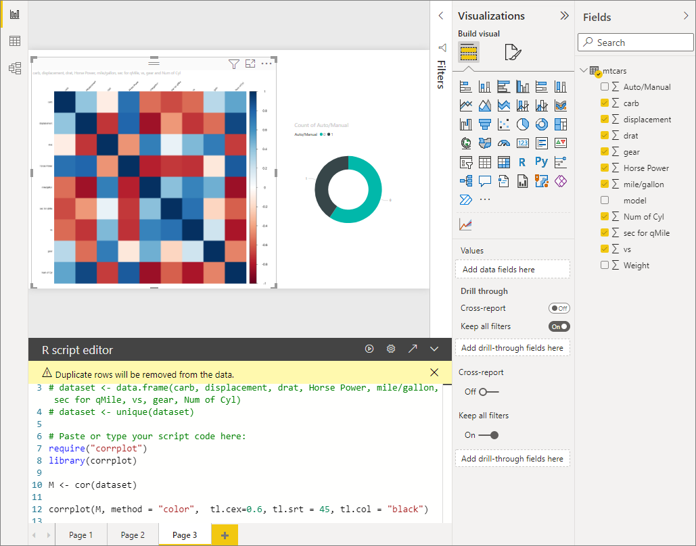

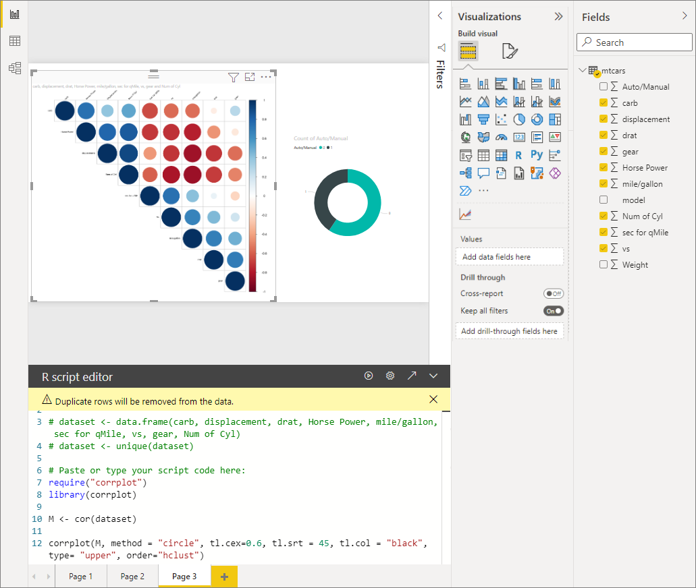

Data hasil R script juga bisa dipakai untuk membuat visual:

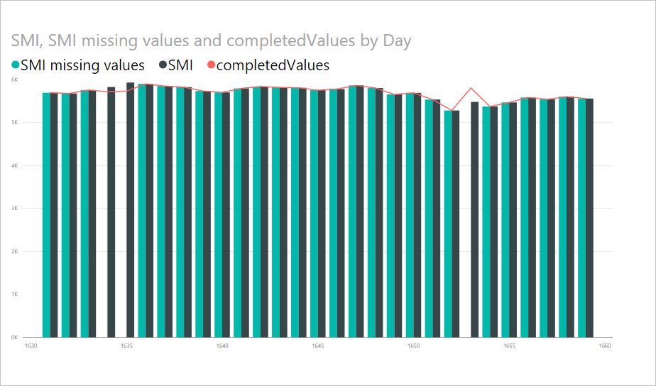

---

## 6. Batasan Singkat

| Area | Batasan |
| --- | --- |
| R Visual | maks 150.000 baris, output 2 MB, 72 DPI, timeout 5 menit, tidak bisa menjadi sumber cross-filter |
| Power BI service | R 4.3.3, payload 30 MB, timeout 1 menit, *publish to web* tidak didukung |
| Power Query | semua data source harus **Public**; refresh butuh **personal gateway** (enterprise gateway tidak bisa) |

---

## 7. Referensi

| Topik | Sumber |
| --- | --- |
| R Visual | [Create Power BI visuals using R](https://learn.microsoft.com/en-us/power-bi/create-reports/desktop-r-visuals) |
| R di Power Query Editor | [Use R in Power Query Editor](https://learn.microsoft.com/en-us/power-bi/connect-data/desktop-r-in-query-editor) |
| Package di service | [Supported R packages](https://learn.microsoft.com/en-us/power-bi/connect-data/service-r-packages-support) |

Semua screenshot di `images/rpowerbi/` berasal dari dua artikel Microsoft Learn di atas (lisensi CC BY 4.0), dengan nama file sama seperti sumbernya.

- [Main README](README.md) — business case & dashboard.
- [R Basics](BASICR.MD) — fondasi R, `dplyr`, `ggplot2`.
- [R Cheat Sheet](CHEATSEET.MD) — ringkasan sintaks.
